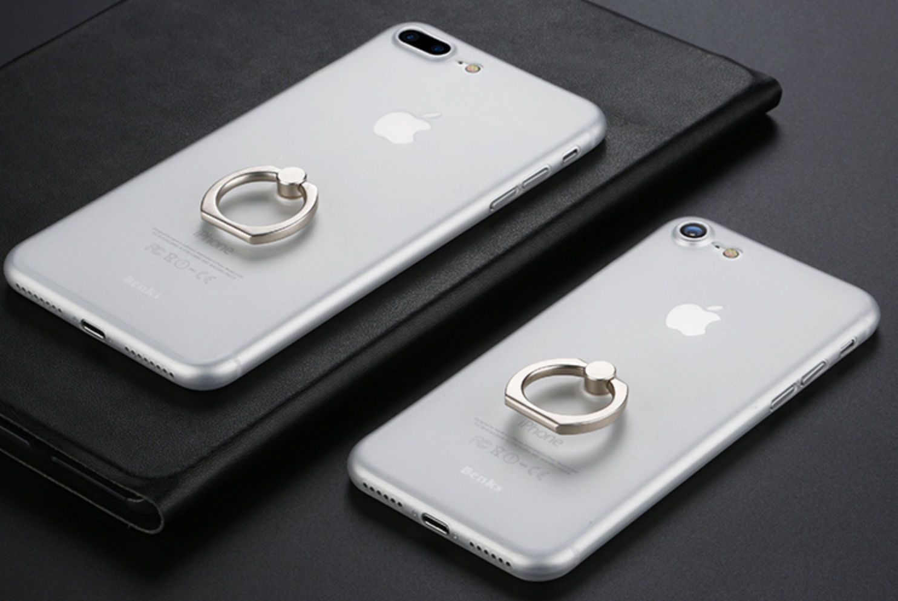

# 装饰器模式 介绍

## 概念

装饰器模式（Decorator Pattern）允许向一个现有的对象添加新的功能，同时又不改变其结构。这种类型的设计模式属于结构型模式，它是作为现有的类的一个包装。动态地给一个对象添加一些额外的职责。就增加功能来说，装饰器模式相比生成子类更为灵活。

## 示例

手机上套一个壳可以保护手机，壳上粘一个指环，可以挂在手指上不容易滑落，这就是一种装饰。手机还是那个手机，手机的功能一点都没变，只是在手机的外面装饰了一些其他附加的功能。日常生活中，这样的例子非常多。

