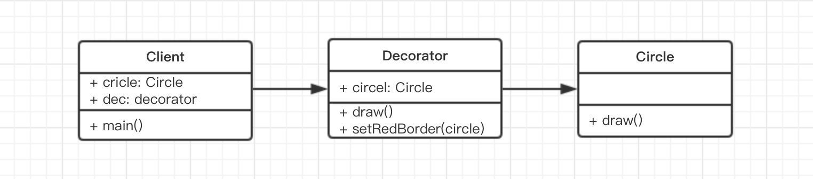

# 装饰器模式 演示

通常的 UML 类图


去掉父子类的继承（前端少用），简化之后的类图是



代码演示

```js
class Circle {
    draw() {
        console.log('画一个原型')
    }
}

class Decorator {
    constructor(circle) {
        this.circle = circle
    }
    draw() {
        this.circle.draw()
        this.setRedBoder(circle)
    }
    setRedBoder(circle) {
        console.log('设置红色边框')
    }
}

// 测试代码
let circle = new Circle()
circle.draw()

let dec = new Decorator(circle)  // 装饰
dec.draw()
```


结合本示例，联想一下开始介绍的手机壳，是一个道理，都是外面加一层装饰，且不改变原有功能。
