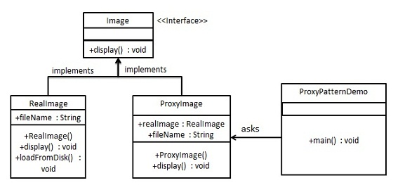
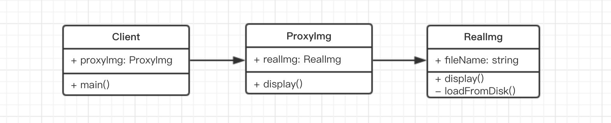

# 代理模式 演示

常见的 UML 类图是



简化之后



代码描述

```js
class ReadImg {
    constructor(fileName) {
        this.fileName = fileName
        this.loadFromDisk()  // 初始化即从硬盘中加载
    }
    display() {
        console.log(`display...` + this.fileName)
    }
    loadFromDisk() {
        console.log(`loading... ` + this.fileName)
    }
}

class ProxyImg {
    constructor(fileName) {
        this.realImg = new ReadImg(fileName)
    }
    display() {
        this.realImg.display()
    }
}

// 测试代码
let proxImg = new ProxyImg('1.png')
proxImg.display()
```

关键在于两者都必须用`display`这一个 API 名字，就像你用不用科学上网，访问`youtube.com`的网站都是一样的。
