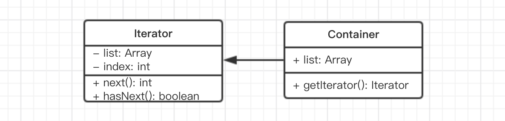

# 迭代器模式 演示

先看下传统的 UML 类图


简化之后的 UML 类图



代码演示如下。大家不必惊讶于：**为何一个简单的数组不直接遍历而是费劲如此周折**？其实：

- 设计模式应用小 demo 本身就会变得更加复杂，让人费解，这很正常
- 该示例是演示如何生成迭代器，故而将数组生成迭代器再遍历，而不是直接遍历

```js
class Iterator {
    constructor(conatiner) {
        this.list = conatiner.list
        this.index = 0
    }
    next() {
        if (this.hasNext()) {
            return this.list[this.index++]
        }
        return null
    }
    hasNext() {
        if (this.index >= this.list.length) {
            return false
        }
        return true
    }
}

class Container {
    constructor(list) {
        this.list = list
    }
    getIterator() {
        return new Iterator(this)
    }
}

// 测试代码
let container = new Container([1, 2, 3, 4, 5])
let iterator = container.getIterator()
while(iterator.hasNext()) {
    console.log(iterator.next())
}
```
