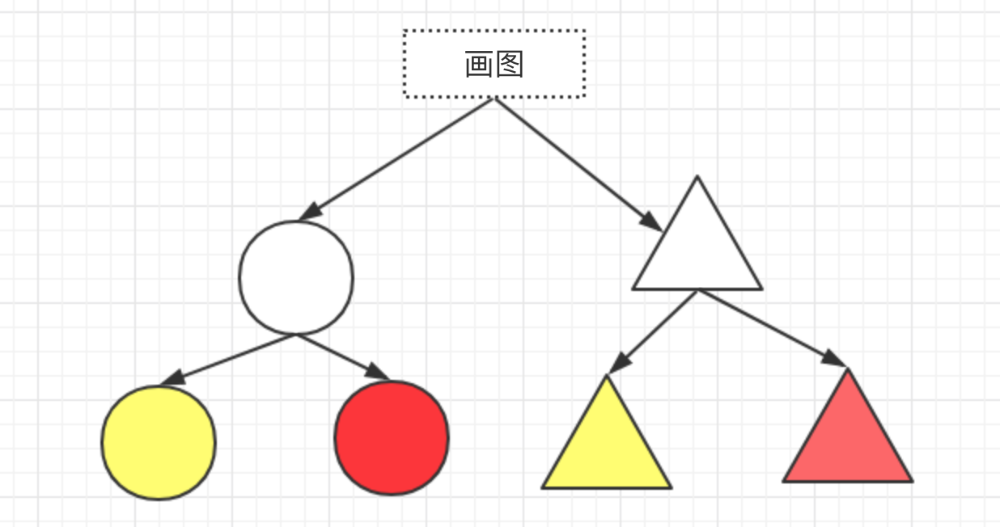
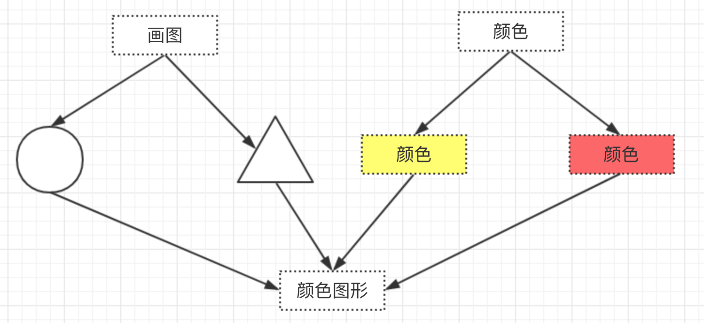

# 桥接模式

桥接（Bridge）是用于把抽象化与实现化解耦，使得二者可以独立变化。在常见的 JS 代码中找不到合适的例子，下面例子比较合适。

画有颜色的图形，第一种设计方式如下



示例代码

```js
class ColorShape {
    yellowCircle() {
        console.log('yellow circle')
    }
    redCircle() {
        console.log('red circle')
    }
    yellowTriangle() {
        console.log('yellow triangle')
    }
    redTriangle() {
        console.log('red triangle')
    }
}

// 测试
let cs = new ColorShape()
cs.yellowCircle()
cs.redCircle()
cs.yellowTriangle()
cs.redTriangle()
```

第二种设计方式



示例代码

```js
class Color {
    constructor(name) {
        this.name = name
    }
}
class Shape {
    constructor(name, color) {
        this.name = name
        this.color = color
    }
    draw() {
        console.log(`${this.color.name} ${this.name}`)
    }
}

// 测试代码
let red = new Color('red')
let yellow =  new Color('yello')
let circle = new Shape('circle', red)
circle.draw()
let triangle = new Shape('triangle', yellow)
triangle.draw()
```

显然，第二种方式更加符合开放封闭原则。

另外一个原则 —— **少继承，多聚合**
