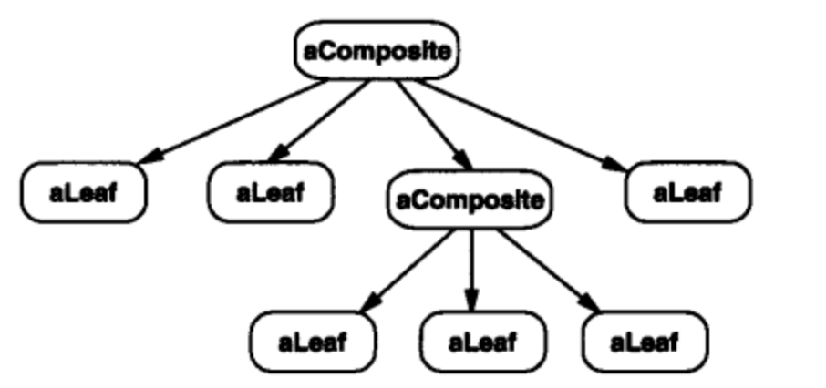
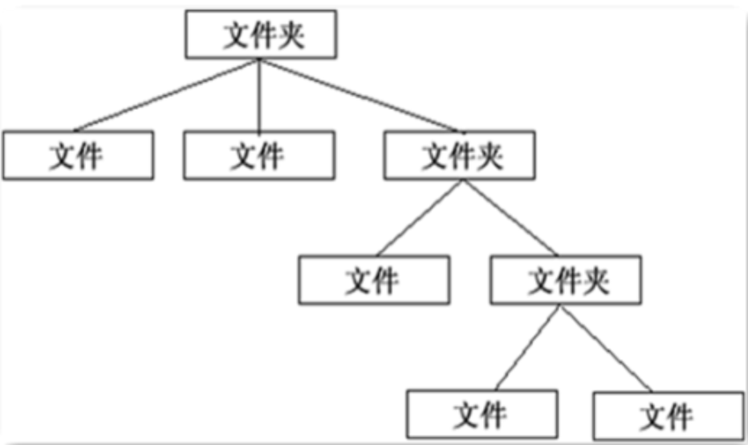

# 组合模式

组合模式，将对象组合成树形结构以表示“部分-整体”的层次结构，组合模式使得用户对单个对象和组合对象的使用具有一致性。

按照传统组合模式中数据结构应该是这样的



例子



不过 JS 中基本没有那么复杂的类型，例如虚拟 DOM 中的 vnode 结构，类型比较单一。例如

```html
<div id="div1" class="container">
    <p>123</p>
    <p>456</p>
</div>
```

以上结构可被定义为

```js
{
    tag: 'div',
    attr: {
        id: 'div1',
        className: 'container'
    },
    children: [
        {
            tag: 'p',
            attr: {},
            children: ['123']
        },
        {
            tag: 'p',
            attr: {},
            children: ['456']
        }
    ]
}
```

**关键的一点，对于整体还是单个节点的操作都是一致的**。例如，以上结构无论是拿到`div`节点还是`p`节点，数据结构都是一样的。
