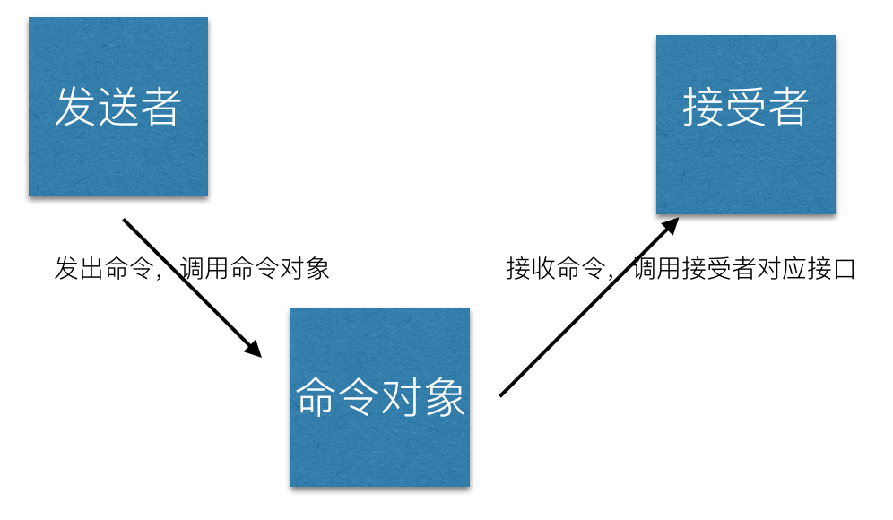

# 命令模式

执行一个命令时，将命令的触发者和执行者分开，不让触发者直接操作命令执行者。



代码演示

```js
class Receiver {
    exec() {
        console.log('执行')
    }
}
class Command {
    constructor(receiver) {
        this.receiver = receiver
    }
    cmd() {
        console.log('触发命令')
        this.receiver.exec()
    }
}
class Invoker {
    constructor(command) {
        this.command = command
    }
    invoke() {
        console.log('开始')
        this.command.cmd()
    }
}

// 士兵
let soldier = new Receiver()
// 小号手
let trumpeter = new Command(soldier)
// 将军
let general = new Invoker(trumpeter)
general.invoke()
```

实际的例子不是很多，可列举一个。要做一个 web 富文本编辑器，需要 JS 操作文本的样式，例如要对选中的文本进行加粗，需要执行`document.execCommand('bold')`。这个 API 用到的就是命令模式，即我作为使用者是需要下达一个`bold`命令即可，如何执行我不用关心。撤下就执行`document.execCommand('undo')`，恢复就执行`document.execCommand('redo')`。

如何做到撤销和恢复，可参考备忘录模式。
