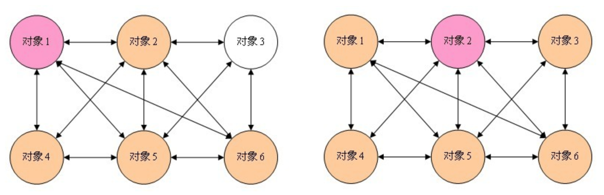
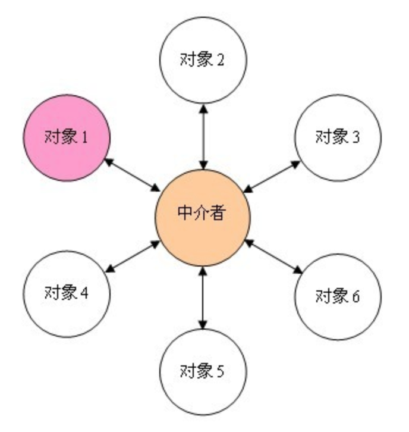

# 中介者模式

普通的多对象通讯的场景



代码演示：

```js
class A {
    constructor() {
        this.number = 0
    }
    setNumber(num, b) {
        this.number = num
        if (b) {
            b.setNumber(num * 100)
        }
    }
}

class B {
    constructor() {
        this.number = 0
    }
    setNumber(num, a) {
        this.number = num
        if (a) {
            a.setNumber(num / 100)
        }
    }
}

// 测试代码
let a = new A()
let b = new B()
a.setNumber(100, b)
console.log(a.number, b.number)  // 100 10000
b.setNumber(100, a)
console.log(a.number, b.number)  // 1 100
```

以上代码中，`a`和`b`产生了耦合关系。使用了中介者之后：



代码演示：

```js
class Mediator {
    constructor(a, b) {
        this.a = a
        this.b = b
    }
    setA() {
        let number = this.b.number
        this.a.setNumber(number * 100)
    }
    setB() {
        let number = this.a.number
        this.b.setNumber(number / 100)
    }
}

class A {
    constructor() {
        this.number = 0
    }
    setNumber(num, m) {
        this.number = num
        if (m) {
            m.setB()
        }
    }
}

class B {
    constructor() {
        this.number = 0
    }
    setNumber(num, m) {
        this.number = num
        if (m) {
            m.setA()
        }
    }
}

// 测试代码
let a = new A()
let b = new B()
let m = new Mediator(a, b)
a.setNumber(100, m)
console.log(a.number, b.number)  // 100 10000
b.setNumber(100, m)
console.log(a.number, b.number)  // 1 100
```

这个设计模式应该更加体现到业务代码中，目前没有找到特别合适的讲解示例。

