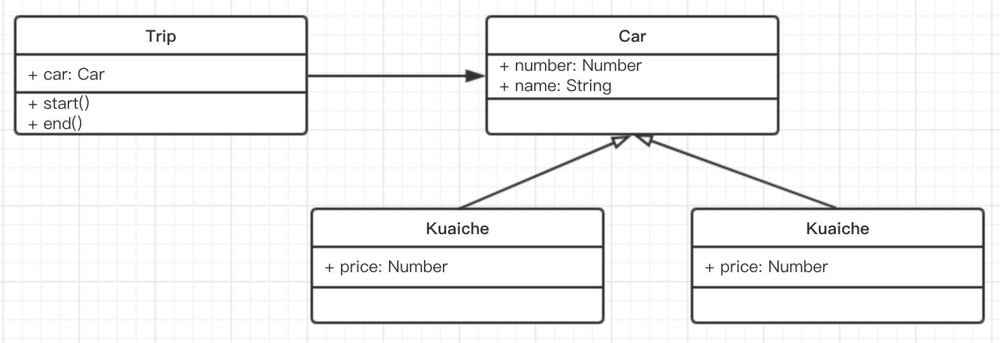

题干描述

- 打车时，你可以打快车和专车
- 无论什么车，都有车牌号和车辆名称
- 打不同的车价格不同，快车每公里 1 元，专车每公里 2 元
- 打车时，你要启动行程并显示车辆信息
- 结束行程，显示价格（假定行驶了 5 公里）

题目

- 画出 UML 类图
- 用 ES6 语法写出该示例

--------

UML 类图



代码

```js
class Car {
    constructor(number, name) {
        this.number = number
        this.name = name
    }
}
class Kuaiche extends Car {
    constructor(number, name) {
        super(number, name)
        this.price = 1
    }
}
class Zhuanche extends Car {
    constructor(number, name) {
        super(number, name)
        this.price = 2
    }
}

class Trip {
    constructor(car) {
        this.car = car
    }
    start() {
        console.log(`行程开始，名称: ${this.car.name}, 车牌号: ${this.car.price}`)
    }
    end() {
        console.log('行程结束，价格: ' + (this.car.price * 5))
    }
}

let car = new Kuaiche(100, '桑塔纳')
let trip = new Trip(car)
trip.start()
trip.end()
```
